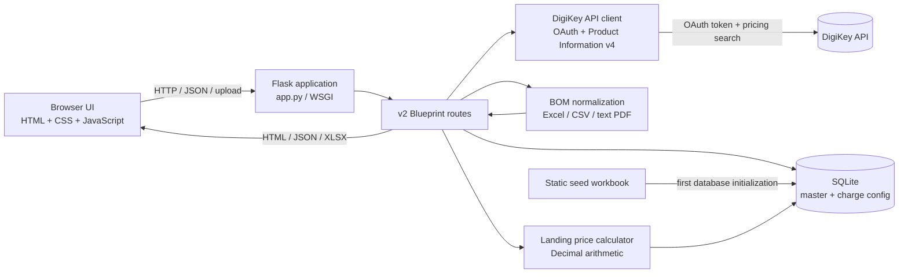

# Project Architecture: Zemicon Landing Price Calculator

This document describes the repository as it is implemented: the Flask application, the v2 calculator, live DigiKey search, the operational master database, BOM import, calculation rules, deployment, and tests.

## 1. What the application does

The application provides a browser based workflow for estimating the INR landing cost of electronic components. Procurement can enter MPNs directly or import a BOM, retrieve product data and quantity pricing from DigiKey, review the local tariff master, enter or edit unit prices and missing tariff values, and calculate per line and shipment totals.

The live DigiKey product search is an enrichment and price source. Customs rates and shipping charge configuration are handled separately by the landing calculator. The calculator does not send DigiKey pricing requests during the calculation endpoint; the browser sends the selected unit price and currency to that endpoint.

## 2. High level architecture



### Request lifecycle

1. `app.py` creates the Flask app, registers the `landing_v2` blueprint, and handles the root redirect, health check, logging, and gateway error page.
2. The browser loads `templates/landing_price_v2.html`, then `static/landing_price_v2.css` and `static/landing_price_v2.js`.
3. JavaScript submits product searches, BOM uploads, master updates, and calculation requests to the v2 HTTP routes.
4. Routes delegate work to the DigiKey client, BOM parser, master lookup, database layer, or calculator module.
5. Route responses are rendered into the page. The calculator result is not persisted as an order or quote record.

## 3. Repository layout

| Path | Responsibility |
| --- | --- |
| `app.py` | Flask application factory instance, local `.env` loader used by direct local startup, blueprint registration, `/` redirect, `/health`, request logging, and 502 page. |
| `wsgi.py` | Imports `app` for WSGI servers. |
| `gunicorn.conf.py` | Production Gunicorn bind, worker, threading, timeout, and log settings. |
| `services/landing_price_v2/__init__.py` | Defines the `landing_v2` Blueprint, registers database teardown, and imports route declarations. |
| `services/landing_price_v2/routes.py` | Page, JSON API, upload, master export/write, DigiKey lookup, and calculate endpoints. |
| `services/landing_price_v2/digikey_api.py` | DigiKey OAuth token handling, HTTP reliability, Product Information v4 pricing search, and response normalization. |
| `services/landing_price_v2/excel_import.py` | Workbook header detection, BOM conversion/normalization, row extraction, and seed workbook reading. |
| `services/landing_price_v2/master_lookup.py` | MPN normalization, tariff record validation, exact normalized lookup, insert-if-new behavior, and master listing. |
| `services/landing_price_v2/database.py` | SQLite connection lifecycle, schema creation, default charge values, seed workbook import, and active charge reads. |
| `services/landing_price_v2/calculator.py` | Input validation, currency conversion, allocation, tariff computation, margin, optional IGST, traces, and totals. |
| `templates/landing_price_v2.html` | Page structure and initial shipment settings. Product and tariff rows are rendered by JavaScript. |
| `static/landing_price_v2.js` | Browser state, MPN lookup, automatic DigiKey tier fill, BOM workflow, previews, stock warnings, and results. |
| `static/landing_price_v2.css` | Responsive calculator styling, loading indicator, tariff cards, and result layouts. |
| `static/digikey-1.xlsx` | Initial tariff master source workbook (when present in the deployment). |
| `tests/test_landing_price_v2.py` | Flask route, DigiKey response, import, database/master, and landing calculation tests. |
| `requirements.txt` | Runtime dependencies. |
| `.env` | Ignored local environment settings; credentials must not be committed. |

## 4. Runtime and startup

### Local development

```powershell
py -m venv .venv
.\.venv\Scripts\Activate.ps1
python -m pip install -r requirements.txt
python app.py
```

Direct `python app.py` startup reads simple `KEY=VALUE` lines from the ignored project `.env` into the process environment, without replacing environment variables that already exist. The development server binds to `127.0.0.1:5000` and enables Flask debug mode.

### WSGI / production

`wsgi.py` exposes the Flask object as `wsgi:app`. Production examples are:

```bash
gunicorn -c gunicorn.conf.py wsgi:app
```

or, on Windows:

```powershell
waitress-serve --host=0.0.0.0 --port=5000 wsgi:app
```

Gunicorn uses `PORT` (default `5000`), two `gthread` workers and two threads per worker by default. `GUNICORN_BIND`, `GUNICORN_WORKERS`, and `GUNICORN_THREADS` override those settings. WSGI startup does not call `load_local_env`; configure production variables in the process/container/platform environment. The app logger records incoming method and path; Gunicorn access and error logs go to standard output/error.

## 5. Browser workflow and client state

The page has product entry, assessable value and charges, tariff review, shipment charges, and results sections. The product table and tariff cards are populated by JavaScript rather than server-rendered records.

Each product row holds the MPN, quantity, editable unit price, local master result, current DigiKey result, selected product match, selected package variation, selected price break, currency mismatch, and whether the fetched information has been reused from the in-page result. This state is transient browser memory and is not saved as a quote.

### Manual MPN flow

1. Enter an MPN and leave the field or press **Search**.
2. JavaScript requests the local tariff master and DigiKey in parallel.
3. If multiple DigiKey products are returned, the user chooses the matching product. A unique exact MPN match is selected automatically.
4. For the selected product, the browser automatically uses the one matching Cut Tape (CT) & Digi-Reel® variation described in section 7. It does not ask the user to select a package.
5. A returned applicable price tier fills the unit price. The price field remains editable; edits are treated as user-entered until the next explicit MPN search.
6. Changing quantity re-evaluates the tier from the already returned pricing list. The page does not make another DigiKey pricing request for each keystroke.
7. The UI shows available stock when DigiKey returns it. If known stock is below requested quantity, the row warns and calculation is blocked.

The Search button can explicitly refresh product data. A repeated lookup with the same MPN and invoice currency may reuse the result already held by that row and labels it as cached.

### BOM flow

The browser uploads the selected file to `/api/landing/v2/import-excel`. The route normalizes it, detects worksheet/header/column candidates, and returns either a column selection prompt or normalized rows. The route also looks up each imported MPN in the local tariff master and includes that match in the response. BOM rows retain their imported unit price and currency fields in the browser. A DigiKey lookup can be run from the row’s Search control.

Accepted file extensions are `.xlsx`, `.xls`, `.csv`, `.tsv`, `.txt`, and text-based `.pdf`. The upload limit is 10 MiB; the import limit is 5,000 line items. Header scanning inspects up to 30 rows per worksheet. Ambiguous columns are surfaced for explicit selection; extended/total/amount columns are not treated as unit prices. Quantity defaults to one only if no quantity value is present. CSV text decoding tries UTF-8 variants, Windows-1252, and Latin-1. PDF parsing extracts tables or readable text; scanned image-only PDFs are not OCRed.

## 6. DigiKey live product search

### Authentication and request

The integration is server-side. It obtains a two-legged OAuth token using client credentials at the configured token URL and calls the Product Information v4 Search pricing endpoint:

```text
GET {DIGIKEY_API_BASE}/products/v4/search/{url-encoded MPN}/pricing
```

The request includes the DigiKey client ID, bearer token, site, language, currency, and optional customer ID headers. Each HTTP request has a 10-second timeout. OAuth tokens are cached in the current Flask process extension until shortly before expiration; the cache is process-local, not shared across Gunicorn workers. Search responses are not stored server-side.

### DigiKey response fields used

The adapter reads the actual Product Information response structure:

| DigiKey response field | Use |
| --- | --- |
| `SettingsUsed.SearchLocale.Currency` | Currency for the returned pricing values. It is not guessed from a default when the response omits it. |
| `ProductsCount` | Product match count metadata. |
| `ProductPricings[]` | Returned product candidates. |
| `ManufacturerProductNumber` | Manufacturer MPN and exact-match comparison. |
| `Manufacturer.Name` | Manufacturer display. |
| `DigiKeyProductNumber` | Product-level DigiKey part number where supplied. |
| `Description.ProductDescription` | Short product description. |
| `Description.DetailedDescription` | Longer description where supplied. |
| `Category.Name` | DigiKey category display. |
| `QuantityAvailable` | Product-level stock metadata. |
| `ProductVariations[]` | Package-specific SKU, inventory, and pricing. |
| `ProductVariations[].PackageType.Name` | Package label; used to find Cut Tape (CT) & Digi-Reel®. |
| `ProductVariations[].DigiKeyProductNumber` | Package-specific DigiKey SKU. |
| `ProductVariations[].QuantityAvailableforPackageType` | Stock for that package/SKU. The UI does not sum stock across package variations. |
| `ProductVariations[].MinimumOrderQuantity` | Minimum order constraint when returned. |
| `ProductVariations[].MaxQuantityForDistribution` | Maximum distribution quantity metadata when returned. |
| `ProductVariations[].MyPricing[]` | Customer-specific breaks, if DigiKey returns them. |
| `ProductVariations[].StandardPricing[]` | Standard breaks when customer pricing is not returned. |
| `BreakQuantity`, `UnitPrice`, `TotalPrice` | Break size and unit/total values within a pricing entry. The calculator uses `BreakQuantity` and `UnitPrice`; extended value is calculated for the requested quantity. |

The adapter currently uses customer pricing when present; otherwise it uses standard pricing. Pricing currency comes from `SettingsUsed.SearchLocale.Currency`, which applies to the normalized tiers.

### Package and price tier rule

The browser selects only a returned variation whose `PackageType.Name` identifies **Cut Tape (CT) & Digi-Reel®** (case-insensitive match for both `Cut Tape` and `Digi-Reel`). Exactly one matching variation is required. No alternate package is silently selected. If none or more than one is returned, price/stock are reported unavailable for the package and calculation is blocked for that line.

For requested quantity `Q`, select the greatest returned break `B` where `B <= Q`. This is the lower-bound quantity break, not the numerically nearest break:

| Returned breaks | Requested quantity | Selected break |
| --- | ---: | ---: |
| 1, 10, 50, 100, 500, 1,000 | 1 through 9 | 1 |
| 1, 10, 50, 100, 500, 1,000 | 10 through 49 | 10 |
| 1, 10, 50, 100, 500, 1,000 | 50 through 99 | 50 |
| 1, 10, 50, 100, 500, 1,000 | 100 through 499 | 100 |

At an exact break, that break applies. If no qualifying break exists, the UI does not extrapolate a price. Unit price is the returned tier’s `UnitPrice`; extended line price is `Q × UnitPrice`. No unreturned reel fee is added by the current calculator. A DigiKey quote may contain a separate fee rule; this implementation only applies fields explicitly parsed from the pricing response and does not invent a fee.

### Currency handling

The page’s invoice currency is a shipment-wide choice of USD or INR. The currency used to fetch DigiKey pricing is sent in the request, but the API response currency is authoritative. If it differs from the shipment currency, the UI does not copy the number into the unit-price field as if it were in the shipment currency. The existing calculator accepts only USD and INR and uses a manually supplied live USD/INR exchange rate plus a 2% adjustment for USD. It does not currently convert arbitrary DigiKey currencies such as EUR.

### DigiKey errors

Missing credentials produce a configuration error. Authentication and permission failures are surfaced with actionable messages; rate limits return HTTP 429; timeouts return HTTP 504; other upstream failures return a generic gateway error. The integration does not automatically retry rate limits or transient failures. HTTP 404 from product pricing is normalized to an empty match result. Credentials, OAuth tokens, and raw upstream error bodies are not returned to the browser.

## 7. Local tariff master and SQLite

SQLite is opened lazily for the active Flask request and stored in Flask’s `g` object. The blueprint teardown closes the connection after the request. The default path is `<Flask instance_path>/landing_price_v2.sqlite`; `LANDING_V2_DATABASE` overrides it.

Tables:

| Table | Purpose |
| --- | --- |
| `digikey_master` | Normalized MPN primary key, display MPN, category, HSN/CTSH, BCD percent, SWS percent, source, and timestamps. |
| `landing_charge_config` | Active/default shipment charge values and their currencies. |
| `landing_v2_metadata` | One-time database initialization marker for seed-master import. |

On first database use, the service reads the configured `DIGIKEY_MASTER_FILE` or defaults to `static/digikey-1.xlsx`, normalizes complete rows, and inserts records with source `DigiKey Excel`. Fractions such as `0.1` in the seed spreadsheet are converted to 10 percent. The `master_seeded` marker is stored after initialization; changing the seed workbook does not refresh an already initialized database automatically.

MPN matching trims and collapses whitespace and compares case-insensitively. It does not fuzzy-match. User-added records are validated and inserted with `INSERT OR IGNORE`; a duplicate normalized MPN is reported as already present and is not overwritten. The master workbook export is generated from current database records at request time.

Default charge rows are inserted when absent:

| Config key | Default | Meaning |
| --- | ---: | --- |
| `DIGIKEY_FREE_SHIPPING_THRESHOLD_INR` | 7,000 INR | Invoice threshold that controls international freight. |
| `DIGIKEY_INTERNATIONAL_FREIGHT_INR` | 1,200 INR | Shipment freight when below threshold. |
| `REMITTANCE_CHARGE_INR` | 3,000 INR | Optional shipment charge. |
| `CHA_PORT_DUES_INR` | 1,100 INR | Optional shipment charge. |
| `DOMESTIC_TRUCKING_INR` | 500 INR | Optional shipment charge. |
| `IGST_RATE_PERCENT` | 18% | IGST rate when optional IGST is enabled. |

There is no HTTP route in this repository to edit charge configuration. Charge values are read from the active SQLite rows and supplied to the page and calculation function.

## 8. BOM import architecture

`normalize_upload` converts supported non-XLSX formats to an in-memory XLSX stream:

- `.xlsx`: passed directly to workbook inspection.
- `.xls`: read with `xlrd`, converted to XLSX rows.
- `.csv`, `.tsv`, `.txt`: decoded and parsed using a detected or extension-based delimiter, then converted to XLSX rows.
- `.pdf`: tables are extracted first; readable text lines are used as a fallback. Image OCR is out of scope.

`inspect_upload` scans up to 30 rows of each worksheet for header aliases. It returns `needs_selection` where worksheet/header/columns are ambiguous. Otherwise it returns normalized `items` containing `mpn`, `unit_price`, `quantity`, and uppercase `currency`. It skips blank MPN lines and limits input to 5,000 items. The route validates currency against USD/INR and attaches the local tariff-master match.

## 9. Landing price calculation

Calculation happens in `calculator.py`, using Python `Decimal` to avoid binary floating-point monetary arithmetic. The function receives JSON input and the active charge configuration; it does not call DigiKey.

### Per-line input and currency

Each line requires an MPN, quantity greater than zero, unit price greater than or equal to zero, and currency USD or INR. USD requires a positive `live_exchange_rate`; the conversion rate is `live_exchange_rate × 1.02`. INR uses rate 1. A local master match supplies category, HSN/CTSH, BCD, and SWS. If no master exists, the request must provide BCD; category/HSN can be supplied, and SWS defaults to 10%.

### Shipment calculation order

1. Convert each line invoice to INR: `quantity × unit price × currency exchange rate`, rounded to paise.
2. Sum line invoices to get the shipment invoice total.
3. Allocate each shipment-level charge to lines by INR invoice share. When all invoices are zero, use quantity shares. Allocation distributes residual paise deterministically so allocations sum to the requested charge.
4. Apply international freight only when the shipment invoice is strictly below the configured threshold; otherwise freight is zero.
5. Calculate insurance per line at 1.125% of the INR invoice.
6. Assessable value is invoice + insurance + allocated international freight. Other charges and the optional remittance/CHA/domestic charges are not included in this assessable value.
7. Calculate BCD on assessable value, rounding to the nearest whole rupee.
8. Calculate SWS on the rounded BCD amount, rounded to paise.
9. Base landed cost is invoice + insurance + allocated freight + allocated remittance/CHA/domestic/other charges + BCD + SWS.
10. Calculate per-unit landing price by dividing base landed cost by quantity.
11. Apply the configured margin percentage to each line’s base landed cost. The margin-inclusive value and per-unit selling price are returned.
12. If IGST is enabled, calculate it on the margin-inclusive value and return final values including IGST.

The result contains per-line values, shipment totals, configuration-derived charge values, and a text trace of the calculation steps. Invalid payloads return HTTP 400; missing tariff conditions may return HTTP 422 according to route result handling.

## 10. HTTP route reference

The v2 routes are declared in `services/landing_price_v2/routes.py`:

| Method | Path | Input | Behavior |
| --- | --- | --- | --- |
| `GET` | `/` | None | Redirects to `/landing/v2`. |
| `GET` | `/health` | None | Returns a simple `{ "ok": true }` health response. |
| `GET` | `/landing/v2` | None | Renders the calculator page with currency and active charge settings. |
| `GET` | `/api/landing/v2/config` | None | Returns supported currencies and active charge settings. |
| `GET` | `/api/landing/v2/product/<mpn>` | MPN path | Exact normalized lookup in local tariff master. |
| `GET` | `/api/landing/v2/digikey-product/<mpn>?currency=USD\|INR` | MPN path and optional currency | Calls DigiKey Product Information pricing search and returns normalized matches. |
| `POST` | `/api/landing/v2/import-excel` | Multipart file and optional worksheet/column selections | Previews ambiguous input or returns parsed BOM rows with local master matches. |
| `POST` | `/api/landing/v2/calculate` | JSON calculation payload | Validates and calculates landing-price lines and totals. |
| `POST` | `/api/landing/v2/master` | JSON object or `items` array | Validates and inserts new tariff master records without overwriting duplicates. |
| `GET` | `/api/landing/v2/master/export` | None | Downloads the current local master as XLSX. |
| `GET` | `/bad-gateway` | None | Renders the application’s 502 error page. |

The product endpoints return `found` and normalized product data; DigiKey errors include an `ok: false` flag and a safe error message. The calculate endpoint accepts `items[]` with `mpn`, `quantity`, `unit_price`, `currency`, optional `live_exchange_rate`, and tariff inputs for an unknown MPN. Shipment fields include `other_charges_total`, `remittance_applicable`, `cha_applicable`, `domestic_trucking_applicable`, `margin_percent`, and `igst_enabled`.

## 11. Configuration

Configuration comes from Flask app configuration, environment variables, or documented defaults. Do not put credentials in JavaScript, templates, Git, or API responses.

| Variable | Purpose | Default / requirement |
| --- | --- | --- |
| `DIGIKEY_CLIENT_ID` | OAuth client ID and request header. | Required for live DigiKey calls. |
| `DIGIKEY_CLIENT_SECRET` | OAuth client secret. | Required for live DigiKey calls. |
| `DIGIKEY_CUSTOMER_ID` | Optional customer pricing request header. | Optional. |
| `DIGIKEY_API_BASE` | Product Information API base URL. | `https://api.digikey.com`. |
| `DIGIKEY_TOKEN_URL` | OAuth token URL. | `https://api.digikey.com/v1/oauth2/token`. |
| `DIGIKEY_LOCALE_SITE` | DigiKey site/region. | `IN`. |
| `DIGIKEY_LOCALE_LANGUAGE` | Response language. | `en`. |
| `DIGIKEY_LOCALE_CURRENCY` | Requested currency when a request does not specify one. | `INR`. |
| `LANDING_V2_DATABASE` | SQLite database location. | Flask instance directory. |
| `DIGIKEY_MASTER_FILE` | Initial tariff seed workbook location. | `static/digikey-1.xlsx`. |
| `PORT` | Default Gunicorn listen port. | `5000`. |
| `GUNICORN_BIND` | Full Gunicorn bind address. | `0.0.0.0:$PORT`. |
| `GUNICORN_WORKERS` | Gunicorn worker process count. | `2`. |
| `GUNICORN_THREADS` | Threads per worker. | `2`. |

## 12. Errors and operational behavior

- Bad JSON, invalid values, unsupported currencies, invalid upload columns, and malformed tariff records return client errors with a JSON message.
- Oversized uploads return HTTP 413; files over 5,000 rows are rejected.
- DigiKey auth/permission issues, rate limits, timeouts, and upstream failures are converted to safe API errors. The browser can still use the local tariff master when live data is unavailable, but live pricing cannot be inferred.
- A known DigiKey stock shortage blocks calculation for that line. Missing stock remains unknown; the UI does not manufacture stock values.
- The OAuth token cache and browser row cache are process/tab local. Restarting a worker or refreshing the browser clears the relevant cache. Search data is not persisted in SQLite.
- The SQLite database must be on persistent storage in hosting environments where the filesystem is ephemeral. Otherwise the tariff master additions and configuration will be lost on redeploy/restart.

## 13. Security and deployment boundaries

Credentials are read on the server. `.env`, `instance/`, and Python caches are excluded by `.gitignore`. Only safe error messages are returned for DigiKey failures; API secrets and bearer tokens are not serialized to the client.

The HTTP routes in this repository do not implement user authentication or authorization. In particular, `POST /api/landing/v2/master` writes persistent tariff data. Deploy the service behind trusted internal access controls before exposing it beyond a controlled environment. Use TLS through the hosting platform or reverse proxy. Restrict who can change environment variables, inspect process configuration, or access persistent SQLite storage.

## 14. Tests and validation

Run the suite from the repository root:

```powershell
python -m unittest discover -s tests -v
```

`tests/test_landing_price_v2.py` covers the Flask routes, local master seeding and HSN lookup, observed-shape DigiKey pricing responses, currency propagation, missing matches, authentication/rate-limit/timeout errors, currency conversion, threshold freight, charge allocation, BCD/SWS, margin, optional IGST, missing tariff records, workbook import, master write/export, and root redirect behavior. DigiKey calls are mocked in tests; they do not require production credentials or call the live service.

Useful static checks:

```powershell
node --check static/landing_price_v2.js
python -m compileall -q services/landing_price_v2
git diff --check
```

## 15. Current scope and known boundaries

- Supported calculator currencies are USD and INR only. DigiKey’s returned currency is respected; the UI avoids copying a price into a different invoice currency without an explicit supported conversion path.
- The automatic package policy is Cut Tape (CT) & Digi-Reel®. Other DigiKey package variations are not used for the automatic price/stock choice.
- The tier rule uses the returned price breaks and chooses the greatest break quantity no larger than the requested quantity. It does not extrapolate below the first break or above returned fields.
- The calculator does not add Digi-Reel fees unless a future implementation explicitly obtains and models such a fee. No price, package, exchange rate, stock, or customs rate is invented by this architecture.
- The `vendor` selector is presentational; the landing calculation remains configured around DigiKey tariff data.
- The calculator produces an estimate and is not a customs/tax determination or a purchase order.
